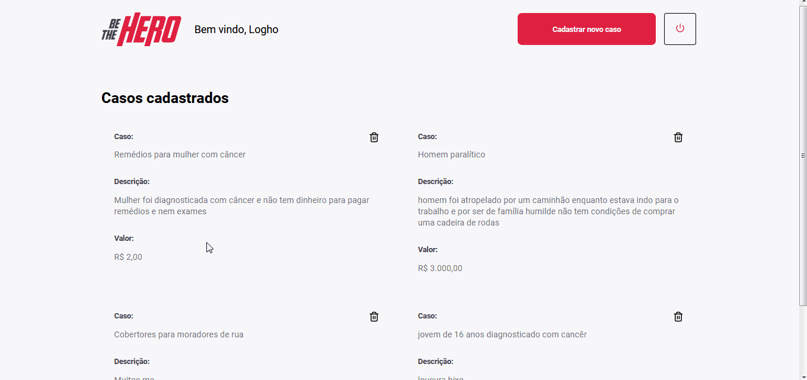
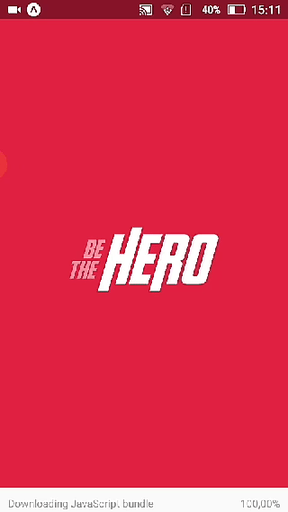

 # Be The Hero
> A plataforma vai juntar pessoas que tem interresse em ajudar monetariamente causas de organizações sem fins lucrativo(ONGs).


```bash
Projeto desenvolvido na semana omnistack 11
```

<p align="center">
  <a aria-label="Versão do Node" href="https://github.com/nodejs/node/blob/master/doc/changelogs/CHANGELOG_V12.md#12.14.1">
    </img>
  </a>
  <a aria-label="Versão do React" href="https://github.com/facebook/react/blob/master/CHANGELOG.md#16120-november-14-2019">
    </img>
  </a>
  <a aria-label="Versão do Expo" href="https://www.npmjs.com/package/expo-cli/v/3.11.5">
    </img>
  </a>
</p>


Esse projeto cadatra ONGs e suas causas na aplicação, tornando mais fácil os heróis(pessoas e empresas) salvarem uma vida ou o mundo. Elas teram em suas mãos o acesso das informações das ONGs(Whatsapp e E-mail), e o detalhes da causa a ser ajudada, podendo assim refletir se podem ajudar com dinheiro ou de outra maneira.


## Instalação
Na pasta `backend\src` execute os seguintes comando para instalar e iniciar o servidor:
```bash
cd backend
yarn install
yarn nodemon src/server.js
```
Para iniciar o frontend, basta usar os comandos a seguir na pasta `backend\src` . O servidor será iniciado na porta 3000(localhost:3000)
```bash
yarn install
yarn start
```

Para iniciar o mobile, você terá que atualizar o arquivo `src/services/api.js`, colocando o ip da sua máquina no lugar de `192.168.15.10` e depois execute os comandos abaixo:
```bash
yarn global add install expo-cli             #caso já tenha o expo instalado no seu pc, não use esse comando
cd mobile
yarn install
yarn start
```

## Como usar



**Web:**
Na versão web, é posível cadastrar ONGs, fazer Login, listar os causas da ONG logada,excluir causas,e criar uma nova causa.



**Mobile:**
Na aplicação mobile, você poderá listar todas as causas, e poderá ver as informações da ONG que casdatrou a mesma, e dentro da aplicação com apenas uns cliques será redirecionado para o whatssapp ou o e-mail da ONG.


## Licença

[MIT](./LICENSE) &copy; [Rocketseat](https://rocketseat.com.br/)

